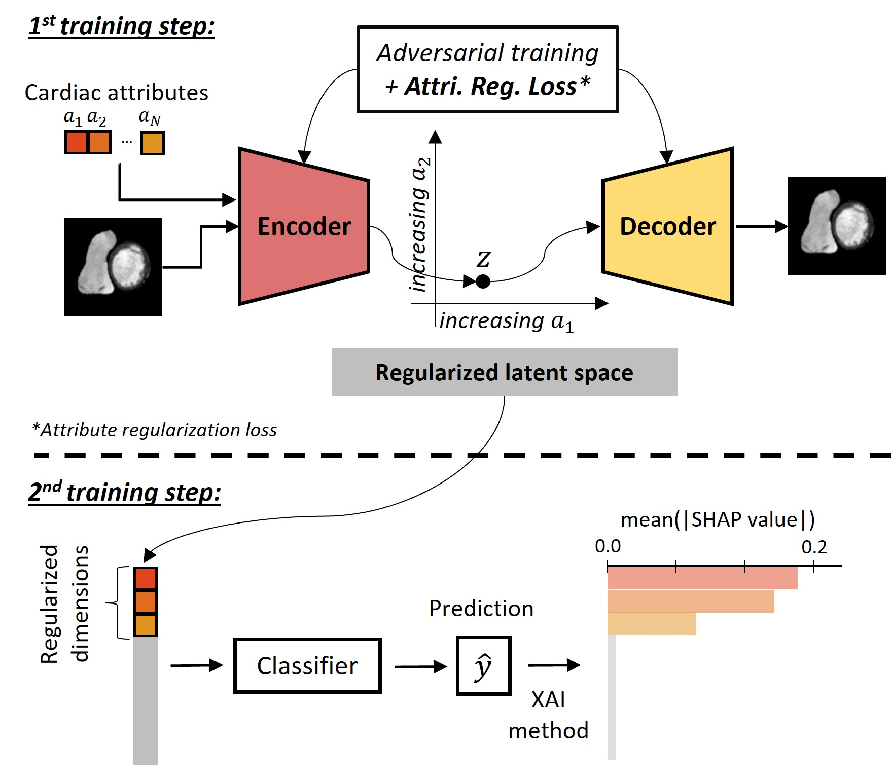

# AR-SIVAE


# Attribute Regularized Soft Introspective Variational Autoencoder for Interpretable Cardiac Disease Classification

**Maxime Di Folco**, Cosimin I. Bercea, Julia A. Schnabel

Submitted to [ISBI 2024](https://biomedicalimaging.org/2024/) 
Preprint [Link to paper](https://arxiv.org/abs/2312.08915).

**Abstract:** *Interpretability is essential in medical imaging to ensure that clinicians can comprehend and trust artificial intelligence models. In this paper, we propose a novel interpretable approach that combines attribute regularization of the latent space within the framework of an adversarially trained variational autoencoder. Comparative experiments on a cardiac MRI dataset demonstrate the ability of the proposed method to address blurry reconstruction issues of variational autoencoder methods and improve latent space interpretability. Additionally, our analysis of a downstream task reveals that the classification of cardiac disease using the regularized latent space heavily relies on attribute regularized dimensions, demonstrating great interpretability by connecting the used attributes for prediction with clinical observations.*




## Citation
If you use this code, please cite our paper:

```
@article{difolco2023,
  title={Attribute Regularized Soft Introspective Variational Autoencoder for Interpretable Cardiac Disease Classification},
  author={Di Folco, Maxime and Bercea, Cosmin I and Schnabel, Julia A},
  journal={arXiv preprint arXiv:2312.08915},
  year={2023}
}
```

## Contents of this repository:

- `data_prepocessing`: notebook to adapt the ACDC dataset to the pipeline and the attributes use to regularize
- `iml-dl`: training and testing the proposed method AR-SIVAE and the method they compare against. Based on: [IML-CompAI Framework](https://github.com/compai-lab/iml-dl) 

All computations were performed using Python 3.8.18 and PyTorch 1.12.1

## Setup:

For setting up wandb please refer to the iml-dl folder or [IML-CompAI Framework](https://github.com/compai-lab/iml-dl).


## Steps to reproduce the analysis:

1)  Data preprocessing:

2) Train the VAE-based models:

    Follow the instructions in `iml-dl/projects/README.md`

3) Train the MLP:

    Follow the instructions in `iml-dl/projects/README.md`